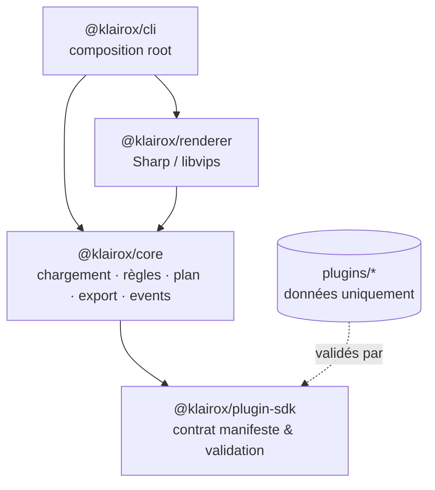

## Contexte

Klairox est un **framework de composition d'assets 2D** : on décrit un type d'asset (cheval, personnage, arme…) dans un manifeste + des images, et le moteur produit les variantes exportées (PNG, WebP, miniature, métadonnées).

Le projet répond à un problème fréquent dans les pipelines de jeu : la plupart des générateurs **codent en dur** ce qu'ils génèrent. Ici, le moteur ne connaît ni les chevaux ni les skins — il charge un **plugin de données**, applique des **règles**, compose et exporte. Un nouveau type d'asset = un nouveau dossier, pas une nouvelle version du moteur.

Stack déjà croisée sur Stalloria (Nx, TypeScript, Vitest) ; sur Klairox l'apprentissage se concentre sur **Zod 4** (contrat unique), **Sharp** (rendu image), les **packages npm publiables** dans un monorepo, et une **architecture hexagonale légère** (contrat / engine / adapter / app) appliquée à un framework plutôt qu'à une app métier.

## À quoi ça sert

| Besoin                                                    | Comment Klairox répond                                       |
| --------------------------------------------------------- | ------------------------------------------------------------ |
| Générer des variantes d'assets sans tout recoder          | Plugin = manifeste + images, zéro code                       |
| Règles métier sur les options (armure cache les marques…) | `constraints` déclaratives (`disable`, `hide`, `require`)    |
| Intégrer dans un pipeline CI / build jeu                  | CLI (`generate`, `validate`, `info`) + codes de sortie 0/1/2 |
| Réutiliser le même moteur dans un éditeur plus tard       | API TypeScript (`KlairoxEngine`) + bus d'événements typé     |
| Autocomplétion des manifests dans l'IDE                   | JSON Schema généré depuis Zod (`npm run schema`)             |
| Changer de backend de rendu sans tout casser              | Port `Renderer` (Sharp aujourd'hui, Canvas/WebGL demain)     |

Cas d'usage concrets : générateur de chevaux (plugin d'exemple `plugins/horse`), créateur de personnages RPG, skins d'armes, toute famille d'assets en couches avec options et contraintes.

## Comment ça fonctionne

### Les trois rôles (+ l'app)



| Package               | Tag Nx          | Rôle                                                |
| --------------------- | --------------- | --------------------------------------------------- |
| `@klairox/plugin-sdk` | `type:contract` | Schéma Zod, types, validation, JSON Schema          |
| `@klairox/core`       | `type:engine`   | Loader, règles, plan de composition, export, events |
| `@klairox/renderer`   | `type:adapter`  | Implémentation Sharp du port `Renderer`             |
| `@klairox/cli`        | `type:app`      | Seul endroit qui câble moteur + renderer            |

Les dépendances ne vont que dans un sens : `@nx/enforce-module-boundaries` en fait une **erreur de lint**, pas une convention.

### Pipeline d'une génération

```
dossier plugin
      │  loadPlugin
      ▼
LoadedPlugin ── manifeste validé, assets vérifiés
      │  resolveSelection
      ▼
Selection ────── défauts + contraintes
      │  buildCompositionPlan
      ▼
CompositionPlan ─ liste ordonnée d'images (données pures, sérialisables)
      │  Renderer.render
      ▼
bytes ────────── PNG / WebP / miniature
      │  exportComposition
      ▼
fichiers + sidecar JSON (sans timestamp → déterministe)
```

Tout jusqu'au `CompositionPlan` est **synchrone, pur, sans I/O**. Recalculer un plan à chaque clic (futur éditeur) est cheap ; seul le raster Sharp coûte.

### Plugin = données

```
plugins/horse/
  plugin.json
  layers/
    body/      standard.png
    coat/      bay.png  black.png  chestnut.png  grey.png
               roan.png  palomino.png  dun.png  cream.png
    ...
```

Idées centrales du manifeste :

- **`dependsOn`** — ordre de _résolution_ des choix (amont avant aval)
- **`order`** — z-index de _peinture_ (distinct de `dependsOn`)
- **`constraints`** — réagissent à la sélection : désactiver une option, masquer une couche, imposer un choix
- **`exports`** — formats, miniature, métadonnées

### API programmatique

```ts
import { KlairoxEngine } from '@klairox/core';
import { SharpRenderer } from '@klairox/renderer';

const engine = new KlairoxEngine({ renderer: new SharpRenderer() });
const plugin = await engine.loadPlugin('plugins/horse');
const { artifacts } = await engine.generate({
  plugin,
  selection: { coat: 'grey', equipment: 'saddle' },
  outputDir: 'dist/assets',
  name: 'grey-horse',
});
```

`engine.plan(plugin, selection)` prévisualise sans écrire de fichiers.

## Organisation du dépôt

```
packages/     plugin-sdk, core, renderer, cli (publiables)
plugins/      exemples data-only (horse)
tools/        art placeholder, JSON Schema, aperçu README
schemas/      plugin.schema.json (généré)
docs/         architecture, référence plugins, roadmap (doc produit EN)
.devbook/     apprentissage + sync The Dev Book (ce dossier)
```

## Nouvelles technologies — vue d'ensemble

| Techno                                   | Déjà connue ?   | Rôle dans le projet                                                   |
| ---------------------------------------- | --------------- | --------------------------------------------------------------------- |
| Nx 23                                    | Oui (Stalloria) | Monorepo, cache, **tags / boundaries** pour un framework à 4 packages |
| TypeScript 6                             | Partiel         | Packages ESM, types exportés                                          |
| Zod 4                                    | Non             | Source unique : validation runtime + types + JSON Schema              |
| Sharp                                    | Non             | Composition d'images via libvips                                      |
| Vitest                                   | Partiel         | Tests unitaires / intégration par package                             |
| YAML                                     | Partiel         | Manifests `plugin.yaml` en plus du JSON                               |
| npm workspaces                           | Partiel         | Packages `@klairox/*` buildables et destinés à npm                    |
| Architecture ports / plugins data-driven | Non             | Moteur agnostique + plugins sans code                                 |

## Commandes utiles

```bash
npm install
npm run build
npm run check                 # lint + typecheck + test + build

npm run klairox -- info plugins/horse
npm run klairox -- validate plugins/horse
npm run klairox -- generate plugins/horse \
  --select coat=chestnut \
  --select markings=blaze \
  --select equipment=saddle \
  --out dist/assets

npm run schema                # régénère schemas/plugin.schema.json
npx nx graph
```

## Difficultés liées aux nouvelles technos

- **Zod 4** : une seule définition doit servir runtime, TypeScript _et_ JSON Schema éditeur — sans faire fuiter Zod hors du SDK.
- **Sharp** : pas d'opacité par couche native au composite → alpha pré-multiplié ; miniatures = second passage (resize avant composite dans un seul pipeline).
- **Deux ordres** (`order` vs `dependsOn`) : les confondre casse soit le rendu, soit les règles.
- **Boundaries Nx** : la coucheing n'est réelle que si les tags + `depConstraints` sont corrects dès le départ.
- **Plugins non fiables** : chemins d'assets doivent rester dans la racine du plugin (anti path-traversal), schéma strict (clés inconnues rejetées), aucune exécution de code plugin.

## Leçons apprises

- Séparer **contrat / moteur / adaptateur / app** dès le premier package évite de coller Sharp ou Zod partout.
- Un plan de composition sérialisable découple l'UI future du rendu coûteux.
- Collecter toutes les erreurs de validation d'un coup (manifeste, assets manquants) transforme le debug plugin en un seul passage.
- Déterminisme (pas de timestamp dans les sidecars, ordre stable) rend le cache pipeline et les diffs Git utiles.
- Documenter le _pourquoi_ (architecture.md, roadmap) en anglais pour l'open source, et garder `.devbook/` pour l'apprentissage personnel / portfolio.

## Documentation technique

| Fiche                            | Sujet                                                       |
| -------------------------------- | ----------------------------------------------------------- |
| `02-tech-nx-packages.md`         | Monorepo Nx orienté packages publiables + module boundaries |
| `03-tech-zod.md`                 | Zod 4 comme source unique du contrat plugin                 |
| `04-tech-sharp.md`               | Renderer Sharp / libvips                                    |
| `05-tech-plugin-architecture.md` | Plugins data-driven, règles, port Renderer                  |
| `06-bilan.md`                    | Ce qui se réutilise sur d'autres projets                    |

## Prochaines explorations

- Phase 4 : matrices de variantes + `klairox batch`
- Projets / templates (`project.yaml`, `klairox init`)
- Éditeur web Angular branché sur le même core + renderer navigateur
- Publication npm `@klairox/*` via `nx release`
- Remplacer l'art placeholder du plugin horse par de vrais assets
