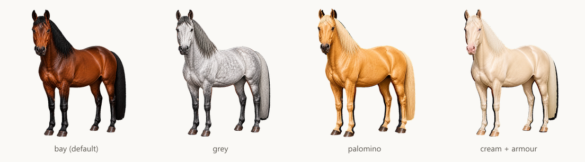
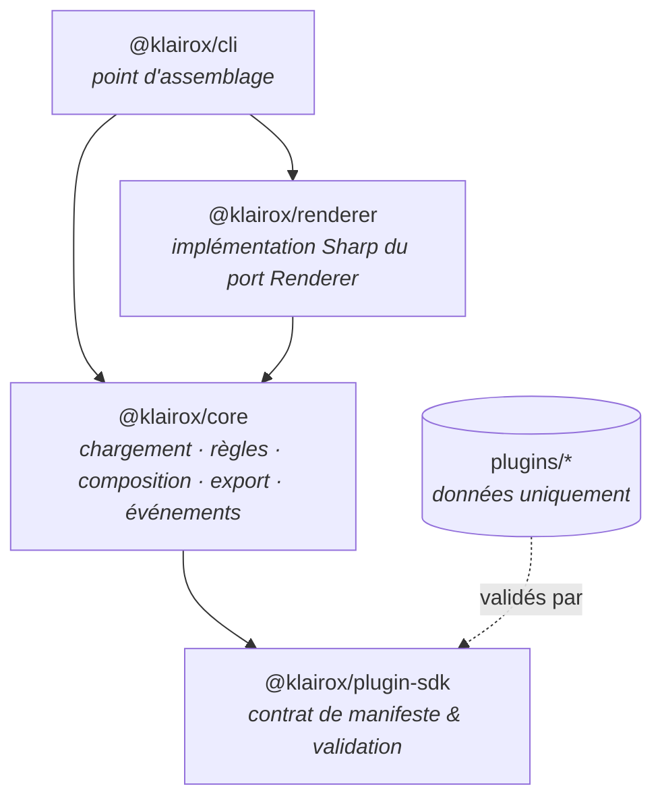

# Klairox

**Un framework de composition d'assets 2D piloté par les données et extensible par plugins.**

[](https://github.com/OliviaG-dev/Klairox/actions/workflows/ci.yml)
[](https://www.typescriptlang.org/)
[](https://nodejs.org/)
[](https://nx.dev/)
[](https://zod.dev/)
[](https://sharp.pixelplumbing.com/)
[](https://vitest.dev/)
[](https://eslint.org/)
[](https://prettier.io/)
[](LICENSE)

[English](README.md) · **Français**

Klairox assemble des images en couches pour produire des assets de jeu finis. Le moteur ne
connaît ni les chevaux, ni les personnages, ni les véhicules : il charge un plugin qui _décrit_
un asset — ses couches, ses options, les règles qui les lient — et construit l'éditeur ainsi que
la chaîne d'export à partir de cette seule description.

Vous écrivez un manifeste, vous déposez vos images, et vous obtenez un générateur d'assets
fonctionnel sans toucher au moteur.



_Quatre assets produits à partir d'un seul plugin et d'une seule commande. Les visuels sont
volontairement schématiques : l'exemple embarque des formes placeholder pour que l'attention
reste sur les règles de composition._

---

## Pourquoi

La plupart des générateurs d'assets codent en dur ce qu'ils génèrent. Klairox découpe le
problème en trois :

- le **contrat** décrit de quoi un asset est fait ;
- le **moteur** résout, compose et exporte, et ne connaît que le contrat ;
- les **plugins** sont des dossiers de données et d'images, sans une ligne de code.

Conséquence : un nouveau type d'asset est un nouveau dossier, pas une nouvelle version. Le même
moteur alimente un générateur de chevaux, un créateur de personnages ou une chaîne de skins
d'armes.

## État du projet

Jeune mais fonctionnel. Le moteur, le système de règles et la CLI sont implémentés et testés de
bout en bout. L'éditeur web n'est pas encore construit — voir la [roadmap](docs/roadmap.md).

## Démarrage rapide

Nécessite Node.js 20 ou plus.

```bash
npm install
npm run build
```

Inspecter le plugin d'exemple fourni :

```bash
npm run klairox -- info plugins/horse
```

Vérifier que son manifeste et tous les assets qu'il déclare sont valides :

```bash
npm run klairox -- validate plugins/horse
```

Générer un asset :

```bash
npm run klairox -- generate plugins/horse \
  --select coat=chestnut \
  --select markings=blaze \
  --select equipment=saddle \
  --out dist/assets
```

```
horse v1.0.0 - 5 layer(s) via sharp

Selection
  body           standard
  coat           chestnut
  markings       blaze
  mane           short
  equipment      saddle

Output
  + dist/assets/horse.png (9.8 kB)
  + dist/assets/horse.webp (5.8 kB)
  + dist/assets/horse.thumbnail.png (4.4 kB)
  + dist/assets/horse.json (910 B)
```

Les couches que vous omettez sont complétées automatiquement : une couche obligatoire prend sa
première option encore autorisée par les contraintes, une couche optionnelle reste vide.

## À quoi ressemble un plugin

Un plugin est un dossier contenant un manifeste et des images. Pas d'étape de build, pas de code.

```
plugins/horse/
  plugin.json
  layers/
    body/      standard.png  heavy.png
    coat/      bay.png  black.png  chestnut.png  grey.png
    mane/      short.png  long.png
    markings/  blaze.png  star.png
    equipment/ saddle.png  armor.png
```

```jsonc
{
  "name": "horse",
  "version": "1.0.0",
  "canvas": { "width": 512, "height": 512 },

  "layers": [
    {
      "id": "coat",
      "order": 20,
      "required": true,
      "dependsOn": ["body"],
      "opacity": 0.9,
      "options": [
        { "id": "bay", "asset": "layers/coat/bay.png" },
        { "id": "grey", "asset": "layers/coat/grey.png" },
      ],
    },
  ],

  "constraints": [
    {
      "id": "armor-hides-markings",
      "description": "Plate armour covers the head, so face markings are not rendered",
      "when": { "equipment": "armor" },
      "hide": ["markings"],
    },
  ],

  "exports": {
    "formats": ["png", "webp"],
    "thumbnail": { "width": 128 },
  },
}
```

Trois idées portent l'essentiel :

- **`dependsOn`** définit l'ordre de résolution : une couche aval est choisie alors que les
  choix amont sont déjà connus. **`order`** est distinct et gère l'empilement.
- **`constraints`** réagissent à une sélection et peuvent désactiver une option (`disable`),
  masquer une couche (`hide`) ou imposer un autre choix (`require`). Le moteur les applique ;
  le plugin reste de la donnée.
- **`exports`** déclare les formats de sortie, la miniature et le fichier de métadonnées.

La référence complète du manifeste se trouve dans [docs/plugins.md](docs/plugins.md). Un JSON
Schema est généré à partir des mêmes définitions que celles utilisées pour la validation, ce qui
permet l'autocomplétion de `plugin.json` dans l'éditeur :

```bash
npm run schema   # écrit schemas/plugin.schema.json
```

## API TypeScript

La CLI n'est qu'une fine couche. Tout est disponible par programmation :

```ts
import { KlairoxEngine } from '@klairox/core';
import { SharpRenderer } from '@klairox/renderer';

const engine = new KlairoxEngine({ renderer: new SharpRenderer() });

engine.on('composition:planned', ({ layerCount, hiddenLayers }) => {
  console.log(
    `${layerCount} couches, ${hiddenLayers.length} masquées par les contraintes`,
  );
});

const plugin = await engine.loadPlugin('plugins/horse');

const { artifacts } = await engine.generate({
  plugin,
  selection: { coat: 'grey', equipment: 'saddle' },
  outputDir: 'dist/assets',
  name: 'grey-horse',
});
```

Besoin d'une prévisualisation sans écrire de fichiers ? `engine.plan(plugin, selection)` renvoie
un objet sérialisable décrivant exactement ce qui serait peint.

## Architecture



Les dépendances ne vont jamais que dans un sens, et cela est vérifié au lint via les tags Nx :
le contrat ne dépend de rien, le moteur ne dépend que du contrat, les adaptateurs implémentent
les ports du moteur, et seules les applications câblent l'ensemble. Le rendu est isolé derrière
une unique interface `Renderer`, si bien qu'un backend Canvas ou WebGL peut remplacer Sharp sans
que le moteur s'en aperçoive.

[docs/architecture.md](docs/architecture.md) détaille la chaîne de traitement et les décisions
de conception.

## Packages

| Package               | Rôle                                                                                         |
| --------------------- | -------------------------------------------------------------------------------------------- |
| `@klairox/plugin-sdk` | Schéma de manifeste, validation et types. Le contrat visé par les auteurs de plugins.        |
| `@klairox/core`       | Chargeur de plugins, moteur de règles, composition, gestionnaire d'export, bus d'événements. |
| `@klairox/renderer`   | Renderer de référence bâti sur Sharp/libvips.                                                |
| `@klairox/cli`        | `klairox generate`, `validate` et `info`.                                                    |

## Organisation du dépôt

```
packages/     les quatre packages publiés
plugins/      plugins d'exemple, données uniquement
tools/        scripts de maintenance (art placeholder, JSON Schema, aperçu du README)
schemas/      JSON Schema généré pour plugin.json
docs/         architecture, référence des plugins, roadmap
```

## Développement

```bash
npm run check       # lint + typecheck + tests + build sur tout le workspace
npm test            # tests unitaires et d'intégration
npm run lint
npm run typecheck
npm run build
```

Nx met en cache chaque tâche, les réexécutions sont donc quasi instantanées. Quelques extras
utiles :

```bash
npx nx run-many -t test --skip-nx-cache
npx nx graph                       # visualiser le graphe de dépendances
npm run example:assets             # régénérer les visuels placeholder
npm run example:generate           # générer l'asset d'exemple avec les valeurs par défaut
```

## Roadmap

Le moteur correspond aux phases 1 et 2 d'un plan plus large : matrices de variantes, fichiers de
projet et templates, éditeur Angular, packaging de plugins. Voir [docs/roadmap.md](docs/roadmap.md).

## Licence

[MIT](LICENSE)
