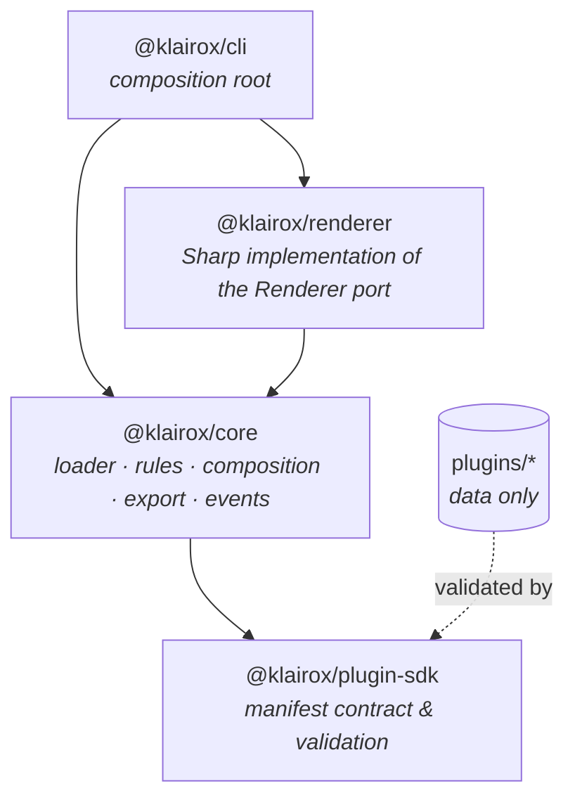

# Klairox

**A data-driven 2D asset composition framework, extensible through plugins.**

[](https://github.com/OliviaG-dev/Klairox/actions/workflows/ci.yml)
[](https://www.typescriptlang.org/)
[](https://nodejs.org/)
[](https://nx.dev/)
[](https://zod.dev/)
[](https://sharp.pixelplumbing.com/)
[](https://vitest.dev/)
[](https://eslint.org/)
[](https://prettier.io/)
[](LICENSE)

**English** · [Français](README.fr.md)

Klairox assembles layered images into finished game assets. The engine knows nothing about
horses, characters or vehicles: it loads a plugin that _describes_ an asset — its layers,
its options, the rules that bind them — and builds the editor and the export pipeline from
that description alone.

Write a manifest, drop in your artwork, and you have a working asset generator without
touching the engine.


_Four assets produced from one plugin. With `klairox batch`, the same plugin can emit a full
matrix of combinations. The artwork is deliberately schematic: placeholder shapes keep the
focus on the composition rules._

---

## Why

Most asset generators hard-code the thing they generate. Klairox splits the problem in three:

- the **contract** describes what an asset is made of;
- the **engine** resolves, composes and exports, and knows only the contract;
- **plugins** are folders of data and images, and contain no code at all.

The upshot: a new asset type is a new folder, not a new release. The same engine drives a
horse generator, a character creator or a weapon skin pipeline.

## Status

Early but working. The engine, the rule system, batch variants and the CLI are implemented and
tested end to end. The web editor is not built yet — see the [roadmap](docs/roadmap.md).

## Quick start

Requires Node.js 20 or later.

```bash
npm install
npm run build
```

Inspect the bundled example plugin:

```bash
npm run klairox -- info plugins/horse
```

Check that its manifest and every asset it declares are valid:

```bash
npm run klairox -- validate plugins/horse
```

Generate an asset:

```bash
npm run klairox -- generate plugins/horse \
  --select coat=chestnut \
  --select markings=blaze \
  --select equipment=saddle \
  --out dist/assets
```

```
horse v1.0.0 - 5 layer(s) via sharp

Selection
  body           standard
  coat           chestnut
  markings       blaze
  mane           short
  equipment      saddle

Output
  + dist/assets/horse.png (9.8 kB)
  + dist/assets/horse.webp (5.8 kB)
  + dist/assets/horse.thumbnail.png (4.4 kB)
  + dist/assets/horse.json (910 B)
```

Layers you leave out are filled in for you: required layers fall back to their first option
still allowed by the constraints, optional layers stay unset.

Generate every combination declared by the plugin's `variants` section:

```bash
npm run klairox -- batch plugins/horse --dry-run
npm run klairox -- batch plugins/horse --out dist/batch
```

```
horse v1.0.0 - batch via sharp

Variants
  axes       coat × equipment
  planned    8
  + horse-bay-saddle (generated)
  + horse-bay-armor (generated)
  …
```

`--dry-run` lists the matrix without writing files. A second run skips unchanged variants
when the metadata sidecar is enabled (the plan hash lives there).

## How a plugin looks

A plugin is a directory containing a manifest and some images. No build step, no code.

```
plugins/horse/
  plugin.json
  layers/
    body/      standard.png  heavy.png
    coat/      bay.png  black.png  chestnut.png  grey.png
    mane/      short.png  long.png
    markings/  blaze.png  star.png
    equipment/ saddle.png  armor.png
```

```jsonc
{
  "name": "horse",
  "version": "1.0.0",
  "canvas": { "width": 512, "height": 512 },

  "layers": [
    {
      "id": "coat",
      "order": 20,
      "required": true,
      "dependsOn": ["body"],
      "opacity": 0.9,
      "options": [
        { "id": "bay", "asset": "layers/coat/bay.png" },
        { "id": "grey", "asset": "layers/coat/grey.png" },
      ],
    },
  ],

  "constraints": [
    {
      "id": "armor-hides-markings",
      "description": "Plate armour covers the head, so face markings are not rendered",
      "when": { "equipment": "armor" },
      "hide": ["markings"],
    },
  ],

  "variants": {
    "axes": ["coat", "equipment"],
    "include": { "body": "standard", "mane": "short" },
    "name": "{plugin}-{coat}-{equipment}",
  },

  "exports": {
    "formats": ["png", "webp"],
    "thumbnail": { "width": 128 },
  },
}
```

Four ideas carry most of the weight:

- **`dependsOn`** orders resolution, so a downstream layer is picked with upstream choices
  already known. **`order`** is separate and controls stacking.
- **`constraints`** react to a selection and can `disable` an option, `hide` a layer or
  `require` another choice. The engine enforces them; the plugin stays data.
- **`variants`** describes a cartesian matrix for `klairox batch`: which layers to cross,
  what stays fixed, and how output files are named.
- **`exports`** declares the output formats, thumbnail and metadata sidecar.

The full manifest reference lives in [docs/plugins.md](docs/plugins.md). A JSON Schema is
generated from the same definitions the engine validates against, so editors can
autocomplete `plugin.json`:

```bash
npm run schema   # writes schemas/plugin.schema.json
```

## TypeScript API

The CLI is a thin wrapper. Everything is available programmatically:

```ts
import { KlairoxEngine } from '@klairox/core';
import { SharpRenderer } from '@klairox/renderer';

const engine = new KlairoxEngine({ renderer: new SharpRenderer() });

engine.on('composition:planned', ({ layerCount, hiddenLayers }) => {
  console.log(
    `${layerCount} layers, ${hiddenLayers.length} hidden by constraints`,
  );
});

const plugin = await engine.loadPlugin('plugins/horse');

const { artifacts } = await engine.generate({
  plugin,
  selection: { coat: 'grey', equipment: 'saddle' },
  outputDir: 'dist/assets',
  name: 'grey-horse',
});

// Expand the variant matrix and export every valid combination
await engine.batch({
  plugin,
  outputDir: 'dist/batch',
  concurrency: 4,
});
```

Need a preview without writing files? `engine.plan(plugin, selection)` returns a plain
serialisable object describing exactly what would be painted. `engine.expandVariants(plugin)`
lists the batch jobs the same way, without rendering.

## Architecture



Dependencies only ever point one way, and that is enforced at lint time through Nx tags:
the contract depends on nothing, the engine depends only on the contract, adapters implement
the engine's ports, and only applications wire everything together. Rendering sits behind a
single `Renderer` interface, so a Canvas or WebGL backend can replace Sharp without the
engine noticing.

[docs/architecture.md](docs/architecture.md) explains the pipeline and the design decisions
in detail.

## Packages

| Package               | Role                                                                       |
| --------------------- | -------------------------------------------------------------------------- |
| `@klairox/plugin-sdk` | Manifest schema, validation and types. The contract plugin authors target. |
| `@klairox/core`       | Plugin loader, rules, composition, batch variants, export manager, events. |
| `@klairox/renderer`   | Reference renderer built on Sharp/libvips.                                 |
| `@klairox/cli`        | `klairox generate`, `batch`, `validate` and `info`.                        |

## Repository layout

```
packages/     the four published packages
plugins/      example plugins, data only
tools/        maintenance scripts (placeholder art, JSON Schema, README preview)
schemas/      generated JSON Schema for plugin.json
docs/         architecture, plugin reference, roadmap
```

## Development

```bash
npm run check       # lint + typecheck + test + build across the workspace
npm test            # unit and integration tests
npm run lint
npm run typecheck
npm run build
```

Nx caches every target, so reruns are near-instant. Useful extras:

```bash
npx nx run-many -t test --skip-nx-cache
npx nx graph                       # visualise the dependency graph
npm run example:assets             # regenerate the placeholder artwork
npm run example:generate           # generate the example asset with defaults
npm run example:batch              # generate the horse variant matrix
```

## Roadmap

Phases 1–4 are done (foundation, rules, CLI, batch variants). Next up: sprite sheets, project
files and templates, an Angular editor, and plugin packaging. See
[docs/roadmap.md](docs/roadmap.md).

## Licence

[MIT](LICENSE)
